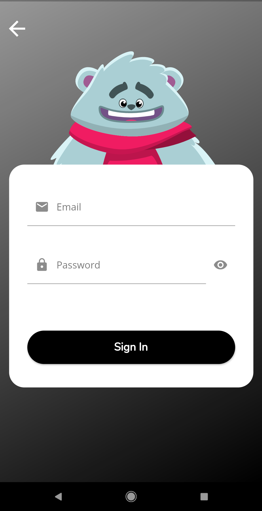
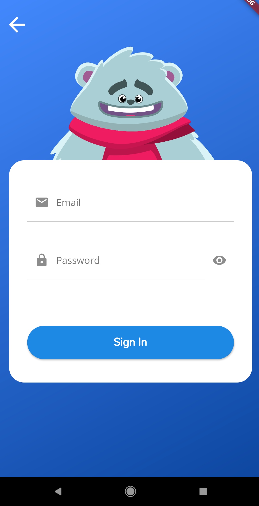
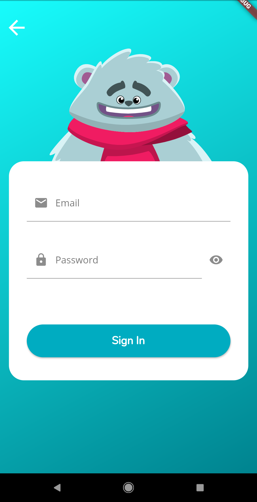
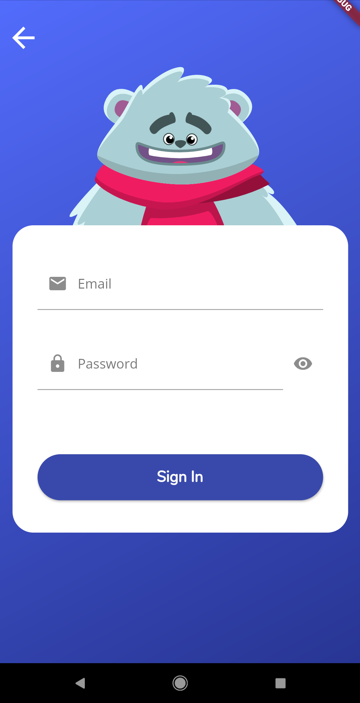
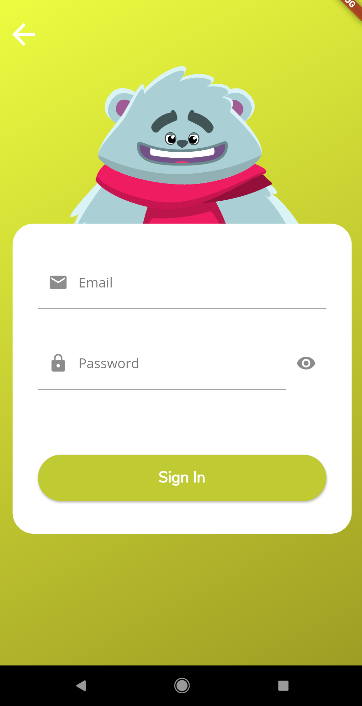
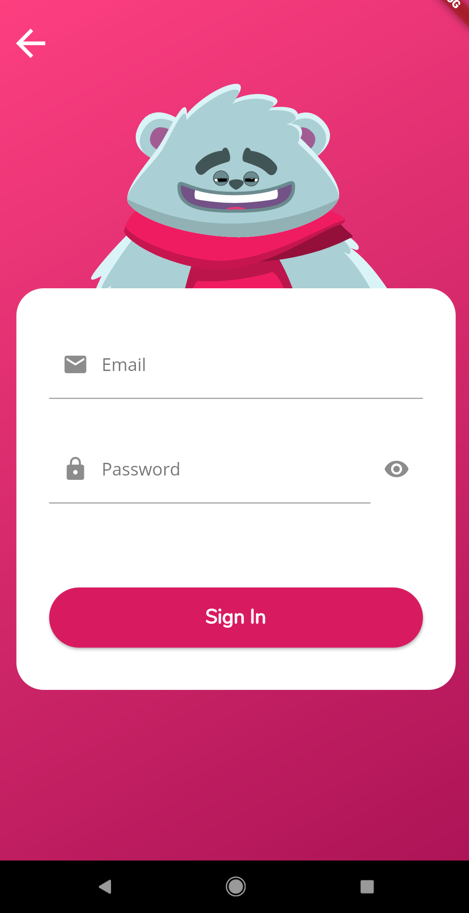

# Flutter Teddy Sign In

A beautiful sign in app design based on Flutter & Flare teddy animation. [Flutter Teddy SignIn apk](https://github.com/GJJ2019/Flutter-Teddy-SignIn/raw/master/app-armeabi-v7a-release.apk).

 #### For App : valid email: gaurav@gmail.com & password: gaurav

## Features
  * [x] [Check if email is valiod or not.](https://raw.githubusercontent.com/GJJ2019/Flutter-Teddy-SignIn/master/screenshot/errors.png)
  * [x] Opens email keyboard when press on email field.
  * [x] Show & Hide button for password field.
  * [x] [Nice loading animation when button is press.](https://raw.githubusercontent.com/GJJ2019/Flutter-Teddy-SignIn/master/screenshot/loading.png)
  * [x] [Teddy fail expression & error snackbar when email or password is invalid.](https://raw.githubusercontent.com/GJJ2019/Flutter-Teddy-SignIn/master/screenshot/fail.png)
  * [x] [Teddy Success expression when login successful.](https://raw.githubusercontent.com/GJJ2019/Flutter-Teddy-SignIn/master/screenshot/success.png)
  * [x] Easily Customisable (with style.dart file).
  * [x] Ready to use material with Todo comments all over project.
  * [x] Responsive design.
  * [x] No Licenses 😀.    

### Created & Maintained By

[Gaurav Jajoo](https://github.com/gjj2019) ([@gjj1998](https://www.instagram.com/gjj1998))

## Star :star: the repo If helpful

# License

    No Licenses 😀.

Note: This project uses teddy which is present in [Flare-Flutter](https://github.com/2d-inc/Flare-Flutter) [Rive](https://rive.app/) so make sure you check out there repo, terms & conditions.

## With Different Colors

  
 
 

## Packages used :
[Flare](https://pub.dev/packages/flare_flutter) [flutter_spinkit](https://pub.dev/packages/flutter_spinkit)

## Getting Started

For help getting started with Flutter, view our online
[documentation](http://flutter.io/).
